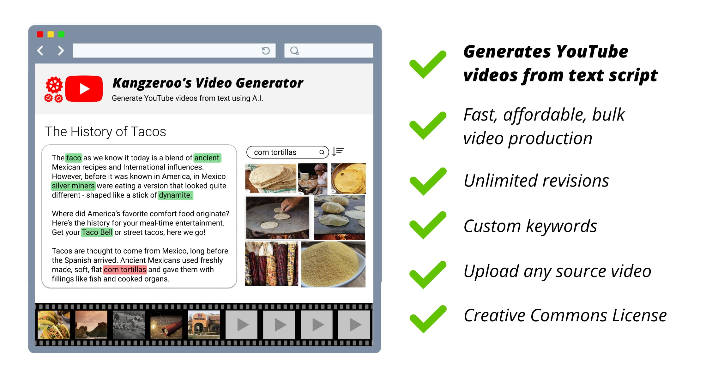

# YouTube Video Generator



This app turns text into a YouTube video. Multiple scenes are generated based on text keywords or phrases you select, such as "dog chasing ball". If you don't like a scene, the app will offer alternatives until you are satisfied. 

Use this app to quickly generate video content in bulk. This is a better alternative to www.Lumen5.com which does not allow you to pick which word/phrases to generate scenes from.

You can also feed this app existing YouTube videos and it will clip it into its individual scenes and tag the entities found in it (eg. "taco"). One 10 min video might get split out into 50+ individual scenes. That allows you to later search for "taco" scenes to be used in your videos.


## Example Workflow

1. You want to use a 5 second clip of a car chase in your YouTube video. You search "police car chase" with this tool. You can also search by audio, so for example if in a video someone is saying "police" but no police car is in the video itself, you will still see results with a police car chase.

2. A list of 5-10 second car chase scenes are shown to you, with thumbnails to quickly scan through the library. If you can't find what you're looking for, you can also feed this tool an existing YouTube video url and it will download the video, clip it into its independent scenes, and add metadata to make it searchable next time.

3. You download the clip you want and viola! Use it however you wish. Note that this is a video generator not editor, it simply helps with media sourcing. You'll still need to use a dedicated video editor like Adobe Premier.

## Limitations

1. This tool does not handle copyright or manipulate videos in any way that will bypass YouTube content-id detection. That is up to you.

2. This tool only knows of the videos its been fed. It does not have access to videos unless it's been given access to those videos before.

## Run in development
It is highly recommended you first code in the `functions/src/sandbox/**.ts` folder before attempting to deploy to firebase. It is much faster than deploying to a dev firebase infrastructure or a local firebase simulator. After local sandbox dev, try it out in the local firebase emulator. Then in dev cloud environment.

Run the below command:
```
$ npm run sandbox ./src/sandbox/your-sandbox-file.ts
```

The `npm run sandbox` will run `ts-node` on your sandbox typescript file, handle authentication, and also output the console.log to your Chrome console at `chrome://inspect/#devices` (very convinent!).

Always be verifying things work in development before ever porting it over to firebase functions.

## To Do
1. Fix `analyzeSceneShots` Error: ENOENT: no such file or directory, stat '/tmp/0'. Might be related to fs.readFile [race condition](https://stackoverflow.com/questions/60984659/error-enoent-no-such-file-or-directory-even-when-file-exists-in-firebase-cloud)
2. Move out API keys to environment variables
3. Test it in production