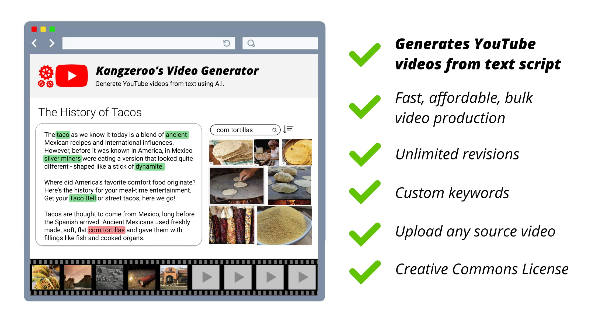
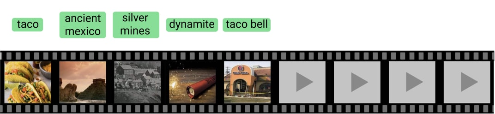
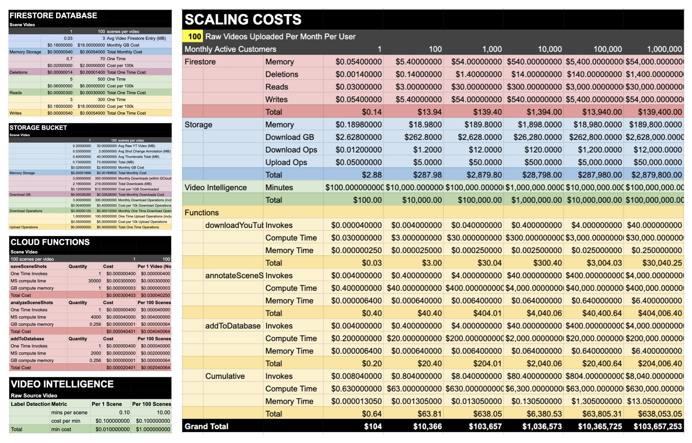

# YouTube Video Generator



This app turns text into a YouTube video. Multiple scenes are generated based on text keywords or phrases you select, such as "dog chasing ball". If you don't like a scene, the app will offer alternatives until you are satisfied. 

Use this app to quickly generate video content in bulk. This is a better alternative to www.Lumen5.com which does not allow you to pick which word/phrases to generate scenes from, nor allow you to upload your own source videos.

You can upload your own source file and it will clip it into its individual scenes and tag the entities found in it (eg. "taco"). One 10 min video might get split out into 50+ individual scenes. That allows you to later search for "taco" scenes to be used in your videos.

This is an internal tool intended for use within Kangzeroo's VA team 💅💪


## Example Workflow




1. Paste in your text script and highlight the words or phrases you want to generate scenes from. For example, the phrase "high speed car chase".

2. The app will return your multiple 5 second clips of a car chase for you to pick from. You can also search by audio, so for example if in a video someone is saying "police" in a scene, that will appear too. Searching by video text is also possible. So if you search for "webull", you may also see a physical advertisement banner for WeBull in a boxing match.

3. If you can't find what you're looking for, you can also feed this tool an existing video and it will download the video, clip it into its independent scenes, and add metadata to make it searchable next time. Typically a 10 min video will get split out into 50+ individual scenes.

4. You download the clip you want and viola! Use it however you wish. Note that this is a video generator not editor, it simply helps with tedious media sourcing. You'll still need to use a dedicated video editor like Adobe Premier.

## Limitations

1. This tool does not handle copyright or manipulate videos in any way that will bypass YouTube content-id detection. That is up to you.

2. This tool only knows of the videos its been fed. It does not have access to videos unless it's been given access to those videos before.

## Run in development
It is highly recommended you first code in the `functions/src/sandbox/**.ts` folder before attempting to deploy to firebase. It is much faster than deploying to a dev firebase infrastructure or a local firebase simulator. After local sandbox dev, try it out in the local firebase emulator. Then in dev cloud environment.

Run the below command:
```
$ npm run sandbox ./src/sandbox/your-sandbox-file.ts
```

The `npm run sandbox` will run `ts-node` on your sandbox typescript file, handle authentication, and also output the console.log to your Chrome console at `chrome://inspect/#devices` (very convinent!).

Always be verifying things work in development before ever porting it over to firebase functions.

## Advanced Auth
Upon initial setup, you may need to impersonate an authorized service account IAM in order to access certain Google Cloud APIs. To do so, run the below command:

```
$ gcloud config set auth/impersonate_service_account [SA_FULL_EMAIL]
```

In our case the [SA_FULL_EMAIL] is `youtube-backend-dev-kz@video-entropy.iam.gserviceaccount.com`, but you will need to request an admin to grant your google account access to this service account.

If you want to clear that IAM impersonation:
```
gcloud config unset auth/impersonate_service_account
```

## Cost Calculations



[Click here to view the full spreadsheet](https://docs.google.com/spreadsheets/d/1PahIgWfpDr5yOXBfUPKXhtOMWBgpnYiYYs2ABJZMHBc/edit?usp=sharing)


## To Do
1. Move the scene saving to upload in parallel
2. Consider refactoring the order of video annotation to save costs (since shot detection is free with labeling)
3. Clean up code to be more readable
4. Move out dev API keys to firebase-style environment variables
5. Test it in production
6. Write tests when ironed out
7. Consider upvote & downvote on scenes so that we dont get a lot of garbage scenes